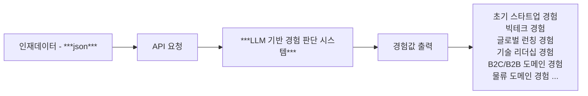

# SearcHRight AI Technical Assignment

## 목표

> **_회사, 재직기간, 직무(타이틀) 만 존재하는 인재 데이터를 기반으로 LLM 을 활용하여 어떤 경험을 했는지, 어떤 역량을 가지고 있는지 추론하기_**

1. 인재 데이터 example 3건 제공합니다.
2. 그 인재 데이터들의 회사 데이터 (뉴스, 재직자 수 변동, 자본금 변동, 투자 라운드 정보) 제공합니다.
   - 만약 더 필요하다면, 외부 데이터를 추가하거나 합치는 것은 상관 없습니다.
   - 원본 데이터를 변형해도 무방합니다.
   - **하지만 추가 또는 변동한 데이터에 대한 "객관적인 사실" 정보가 필요합니다. (출처 등)**
3. LLM 중 OpenAI의 token 제공합니다.
   - 혹시 모를 탈취, 이슈, 보안 등의 이유로 토큰 사용 비용은 $20으로 제한되어 있습니다.
   - 만약 더 필요하다면 부담 없이 아래에 안내된 이메일 또는 안내 받은 유선 번호로 연락 부탁드립니다. 
4. 위 3번 토큰으로 사용이 허용된 API (GPT RestAPI 기준)는 아래와 같습니다.
   - `/v1/models`
   - `/v1/audio`
   - `/v1/chat/completions`
   - `/v1/embeddings`
   - `/v1/images`
   - `/v1/moderations`

## 세부 사항

### 1) 기본 input 과 output flow



#### *"LLM 기반 경험 판단 시스템" 내부 로직*


### 2) 제한 사항

1. `Flask` / `Django` / `FastAPI` 셋 중 하나를 사용해 주세요.
2. "목표"를 이루기 위해 어떠한 형태의 비즈니스 로직이어도 상관 없습니다.
3. 핵심 비즈니스 로직에 대한 테스트 코드는 존재해야 합니다. **최소한의 "단위테스트"를 작성해주세요.**
4. 만약 `MCP` 형태로 구성하거나 또는 `LangChain` 등의 `LLM` 전용 프레임워크를 사용하신다면 README에 `flow chart`를 꼭 추가해주세요.
   - 또는 step by step으로 글로만 작성해도 무방합니다.
5. 어떤 base 모델을 활용하던 상관 없습니다. **하지만 제공되는 토큰은 OpenAI (gpt 계열 모델) 만 제공됩니다.**
6. `docker compose`에 `pgvector` RDBMS로 세팅되어 있습니다.
   - Postgres에서 vector의 similarity search를 하기 위한 extension이 추가된 (Vector 관련 기능) DBMS입니다.
   - https://github.com/pgvector/pgvector 참조
7. `docker compose`를 적극적으로 사용해 주세요.
   - `nginx`도 세팅되어 있으며 8000 port로 리버스프록싱 세팅이 기본으로 설정되어 있습니다.
   - API 구현시 이 부분을 적극적으로 사용해 주세요.

### 3) 성공 테스트셋

1. input `talent_ex1.json`

   - output
     - **`상위권대학교`** (연세대학교)
     - **`성장기스타트업 경험`** (토스 16년도 부터 19년까지 투자 규모 2배 이상 성장, 조직 규모 2배 이상 성장)
     - **`리더쉽`** (타이틀, 챕터 리드, 테크 리드 기반으로 추론)
     - **`대용량데이터처리경험`** (네이버 AI가 21년 부터 하이퍼크로바까지 NLP 관련 처리 많이함)

2. input `talent_ex2.json`

   - output
     - **`상위권대학교`** (서울대학교)
     - **`대규모 회사 경험`** (KT 전략기획실, KT 미디어 사업부 성장전략 팀장 경험)
     - **`리더쉽`** (타이틀, CFO, 성장전략 팀장 경험 기반으로 추론)
     - **`IPO`** (밀리의 서재 CFO 재직 당시, 밀리의 서재가 IPO를 함)
     - **`M&A 경험`** (지니뮤직에서 밀리의 서재 인수 리드)

3. input `talent_ex3.json`

   - output
     - **`상위권대학교`** (연세대학교)
     - **`대규모 회사 경험`** (삼성전자, SKT)
     - **`M&A 경험`** (요기요 재직 중 사모펀드에 매각)
     - **`리더쉽`** (타이틀, CPO 경험 다수, 창업)
     - **`신규 투자 유치 경험`** (C level 재직기간 중 회사 신규 투자유치, Kasa Korea, LBox)

### 4) 목표 데이터 셋

- `talent_ex4.json` 을 API body (`payload`) 값으로 요청했을때 아래 output (`response`) 로 돌아와야 합니다.

  - output
    - **`상위권대학교`** (서울대학교)
    - **`대규모 회사 경험`** (삼성전자, 네이버)
    - **`성장기스타트업 경험`** (토스 재직 시 조직 4.5배 확장)
    - **`리더쉽`** (CTO, Director, 팀장 포지션)
    - **`대용량데이터처리경험`** (네이버 하이퍼클로바 개발)
    - **`M&A 경험`** (요기요 재직 중 사모펀드에 매각)
    - **`신규 투자 유치 경험`** (토스 시리즈 F, 엘박스 시리즈 B 투자 유치)

### 5) 평가 척도

- ***차례로 가중치의 크기 입니다.***

1. 문제 해결 접근 방식

   - 문제 이해 및 해결 방법의 창의성
   - LLM 활용의 효율성 및 적절성
   - 제약 조건(토큰 비용 등) 내에서의 최적화 노력
   - 요구사항 외 추가 기능 구현 및 개선점 제안

2. 목표 데이터셋 성공 여부

   - 기대하는 output 값이 정확하게 추출되는지 여부
   - 인재 데이터의 변화에 따른 추론 결과의 일관성
   - 추론 결과의 정확성과 근거의 타당성

3. LLM application 구조

   - 코드의 모듈화 및 구조화 수준
   - 적절한 디자인 패턴 적용 여부
   - 확장성 및 유지보수 용이성
   - 효율적인 벡터 검색 구현 방식

4. API 설계 및 구현

   - RESTful API 설계 원칙 준수 여부
   - 응답 시간 및 성능 최적화
   - 에러 핸들링 및 예외 처리 방식
   - API 문서화 및 사용 편의성

5. 테스트 코드 품질

   - 단위 테스트의 커버리지 및 완성도
   - 테스트 케이스의 다양성 및 엣지 케이스 고려 여부
   - 테스트 자동화 및 실행 용이성
   - 테스트 코드의 가독성 및 유지보수성

6. 코드 품질 및 완성도
   - 코드 가독성 및 일관된 코딩 스타일
   - 변수명, 함수명 등의 명명 규칙 준수
   - 주석 및 문서화 수준
   - 리소스 관리 및 최적화 수준

## 기본 세팅 정보

- `python` 3.13 이상 버전을 사용 해주세요. (`pyenv` 사용을 추천합니다.)
- `poetry` 사용을 추천합니다. (다른 가상환경, 패키지 매니저로 변경해도 무방하나, 라이브러리 버전에 유의해야 함)
  - `requirements.txt`는 제공되지 않습니다. `poetry`를 사용하지 않는다면, `pyproject.toml`를 참조해주세요.
  - 자유롭게 라이브러리를 추가 및 설치하셔도 좋습니다.
- `git clone` 이후 새로운 repo 를 만드셔서 `remote add & push` 로 진행하시거나 또는
- `fork` 를 통해서 바로 저장소를 복제하셔서 작업을 바로 진행하셔도 됩니다.
  - `fork` 의 경우 원본 저장소에 대해 버저닝 (PR, Issue 등) 을 하실필요 없습니다.

### 1) 사전 데이터 세팅하기

> 가상환경과 docker compose 를 실행한 상태에서 아래 커멘드, 사전 세팅을 F/U 해주셔야 정상 작동 합니다.

1. `example_datas` 경로로 이동한 상태에서 아래 스크립트를 차례로 실행해 주세요.
2. `python ./setup_company_data.py`
3. `python ./setup_company_news_data.py`

### 2) 구현 QnA

1. 사전 데이터에 특정 회사가 없어요!

   - 의도적으로 제외 시킨 회사 정보입니다.
   - 외부 데이터를 전혀 활용하지 않거나, Base Model (LLM) 의 추론에 기대해도 괜찮고 직접 특정 외부 데이터를 직접 넣어서 일부분만 활용해도 괜찮습니다.

2. 사전 데이터에 특정 회사 뉴스데이터가 없어요!

   - 1번에 대한 답변과 같습니다.

3. "성공 테스트셋" 에서 기대되는 결과 그 이상의 값을 output 으로 만들어도 되나요?

   - 네, 테스트셋의 output 은 최소한으로 꼭 판단되어야 하는 tag 에 대한 명시입니다.

4. 요청할때마다 output 이 달라져도 되나요?

   - 네, 하지만 위 2번에서 말한것과 같이 최소한으로 꼭 판단되어야 하는 tag는 동일해야 합니다.

5. 요청의 응답이 json 이어야 하나요?

   - 네!

6. API 의 구현에 대한 제한은 없나요?

   - 없습니다. 다만 RestFul 한지, 낮은 결합도 높은 응집도에 대한 고민이라던지, 테스트 하기 용이한다던지에 대한 평가 척도는 존재합니다.

7. DBMS 의 테이블 구조 변경 / 추가 / 삭제에 대한 제한은 없나요?

   - 초기 데이터, 테이블 세팅만 지켜진다면 제한 사항이 없습니다. 자유롭게 바꿔주세요.

8. Vector DBMS 는 다른 것을 사용해도 되나요?

   - 네, 무방합니다. 하지만 평가를 위해 오픈소스 기반이어야 하며 실행하기 위한 기본 조건, 제한 조건을 README 에 기록해 주세요.

9. docker compose 의 내용을 바꿔도 되나요?

   - 위 8번에 대한 답변과 동일합니다.

10. 사용하는 데이터에 대한 스키마 정의가 되어 있나요?
    - 없습니다. 데이터 해석도 해당 과제에 포함되어 있습니다.

11. OpenAI (GPT) API 토큰 값은 어디에 있나요?
    - 해당 과제를 안내드릴때 토큰과 함께 안내드렸습니다.

---

## 🆕 추가된 기능들

### 서버 실행방법
```bash
# .env 환경 구축
cp .env.local .env

cd system-docker

docker-compose build
# Docker 컨테이너 실행
docker-compose up -d
```

### 📊 완전한 테스트 인프라스트럭처

프로젝트에 포괄적인 단위 테스트 시스템이 구축되었습니다:

- **라우터 테스트** (`tests/test_analysis_router.py`)
  - API 엔드포인트 기능 검증
  - GET/POST 요청 처리 테스트
  - 에러 핸들링 검증
  - 응답 구조 확인

- **스키마 테스트** (`tests/test_analysis_schema.py`)
  - Pydantic 모델 검증
  - 요청/응답 데이터 구조 테스트
  - LLM 설정 검증
  - 필드 유효성 검사

- **통합 테스트** (`tests/test_analysis_integration.py`)
  - 전체 워크플로우 테스트
  - 동시 요청 처리 검증
  - 다양한 LLM 제공자 테스트
  - 실제 API 동작 확인

### 🎯 API 응답 구조 개선

- **메타데이터 필드 제거**: API 응답에서 `metadata` 필드가 제거되어 더 깔끔한 응답 구조를 제공합니다.
- **응답 일관성 향상**: 모든 API 엔드포인트에서 일관된 응답 형식을 보장합니다.

### 🐳 Docker 환경 최적화

- **Docker 호환성**: 컨테이너 환경에서 안정적인 테스트 실행을 위한 최적화
- **환경 격리**: 테스트 간 격리를 통한 신뢰성 향상
- **자동 재시도**: Docker race condition 처리를 위한 스마트 재시도 메커니즘

### 🔧 Pydantic v2 완전 호환성

- **필드 별칭 최적화**: camelCase ↔ snake_case 변환 완벽 지원
- **검증 로직 강화**: 모든 데이터 모델에서 엄격한 타입 검증
- **에러 처리 개선**: 더 명확하고 유용한 검증 에러 메시지

---

## 🧪 단위 테스트 실행 가이드

### 📋 테스트 시스템 개요

이 프로젝트는 **37개의 포괄적인 단위 테스트**를 포함하여 analyze 기능의 모든 측면을 검증합니다:

- **9개 라우터 테스트**: API 엔드포인트 동작 검증
- **19개 스키마 테스트**: 데이터 모델 및 검증 로직 확인
- **9개 통합 테스트**: 전체 시스템 워크플로우 검증

### 🚀 빠른 시작

#### 1. 로컬 환경에서 테스트 실행

```bash
# 백엔드 디렉토리로 이동
cd backend

# 테스트 의존성 설치
pip install -r test-requirements.txt

# 모든 테스트 실행
python run_tests.py
```

#### 2. Docker 환경에서 테스트 실행

```bash
# Docker 컨테이너 실행
docker-compose up -d

# 컨테이너 내부에서 테스트 실행
docker exec -it searchright-ai bash
cd /SEARCHRIGHT
python run_tests.py
```

### 🔧 고급 테스트 옵션

#### 특정 테스트 실행
```bash
# 라우터 테스트만 실행
python run_tests.py --specific test_analysis_router

# 스키마 테스트만 실행  
python run_tests.py --specific test_analysis_schema

# 통합 테스트만 실행
python run_tests.py --specific test_analysis_integration
```

#### 커버리지 리포트 생성
```bash
# 터미널 커버리지 리포트
python run_tests.py --coverage

# HTML 커버리지 리포트 (htmlcov/index.html 생성)
python run_tests.py --html
```

#### 병렬 테스트 실행
```bash
# 병렬로 테스트 실행 (속도 향상)
python run_tests.py --parallel
```

#### 상세 출력
```bash
# 자세한 테스트 출력
python run_tests.py --verbose
```

### 📦 테스트 의존성

테스트 실행에 필요한 모든 패키지는 `test-requirements.txt`에 정의되어 있습니다:

```txt
# 핵심 테스트 프레임워크
pytest>=8.0.0
pytest-asyncio>=0.21.0
pytest-mock>=3.10.0

# HTTP 테스트
httpx>=0.24.0
fastapi[all]>=0.100.0

# 데이터 검증
pydantic>=2.0.0
pydantic-settings>=2.0.0

# 추가 유틸리티
pytest-cov>=4.0.0  # 커버리지 리포트
pytest-html>=3.1.0  # HTML 리포트
pytest-xdist>=3.0.0  # 병렬 실행
```

### 🌍 환경 변수 설정

테스트 실행 시 다음 환경 변수가 자동으로 설정됩니다:

```bash
ENVIRONMENT=testing          # 테스트 환경 모드
DEBUG=false                 # 디버그 모드 비활성화
OPENAI_API_KEY=test-key-for-testing  # 테스트용 API 키
DATABASE_URL=sqlite:///test.db       # 테스트 데이터베이스
LOG_LEVEL=WARNING           # 로그 레벨 설정
```

### 🐛 테스트 문제 해결

#### 일반적인 문제들

1. **의존성 누락**
   ```bash
   pip install -r test-requirements.txt
   ```

2. **Docker 환경에서 간헐적 실패**
   - 테스트 러너가 자동으로 재시도를 수행합니다
   - 대부분의 경우 두 번째 시도에서 성공합니다

3. **포트 충돌**
   ```bash
   # 다른 프로세스가 포트를 사용 중인 경우
   docker-compose down
   docker-compose up -d
   ```

#### 디버깅 옵션

```bash
# 특정 실패한 테스트만 재실행
python run_tests.py --specific test_name

# 더 자세한 오류 정보
python run_tests.py --verbose

# 테스트 실행 시간 분석
python run_tests.py --coverage
```

### 📊 예상 결과

성공적인 테스트 실행 시 다음과 같은 결과를 볼 수 있습니다:

```
================================================================================
                    AI-BE Technical Assignment - Test Runner                    
================================================================================

✅ Test Status: PASSED
⏱️  Execution Time: 1.53 seconds
🔧 Return Code: 0

🎉 All tests passed! The analyze functionality is working correctly.
```

**37/37 테스트 통과 (100% 성공률)**로 모든 analyze 기능이 정상 작동함을 확인할 수 있습니다.

---

문의: dev@searchright.net <br />
유선: 개별로 안내드렸습니다.
